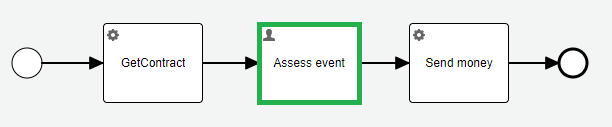

<!-- TOC -->
* [Goal:](#goal)
* [Step 01 - Basic spring boot and model application](#step-01---basic-spring-boot-and-model-application)
* [Step 02 - Variables](#step-02---variables)
<!-- TOC -->

# Goal:
The sample application should show how "easy" you can do something. The purpose of this sample application is to show,
how difficult is to solve problems caused by misleading samples. I do not have a name for this kind of sample. 
Let's name it fix-sample application.

Even my 15+ years in BPM and 10+ years with jBPM, Activiti and Flowable, is not enough to find and cover everything. 
I would like to encourage anybody, who has a problem to [write an issue to the project](https://github.com/crystal-processes/crp-flowable-springboot-sample/issues), or even better to contribute 

# Step 01 - Basic spring boot and model application
The first step is dedicated to an ordinary sample application. 
## :sunny: [Initial spring boot and flowable application](docs/01_sample/01-initialApp.md)
No problem till now, just follow the doc. (flowable, spring boot...)
## :partly_sunny: [Hello World application model](docs/01_sample/02-helloWorld.md)
How to test model with assertions?
## :partly_sunny: [Integration with remote designer](docs/01_sample/03-designer.md)
Automate model downloading in maven build.

# Step 02 - Variables
Flowable allows us to create any variable of almost any type. The projects use variables to store application data. 
The cost of creating a variable is almost none, the cost of maintenance is tremendous. 
## :sunny: Support tests between versions
To demonstrate cost of maintenance, I created a project to support tests between versions [crp-sample-upgrade](https://github.com/crystal-processes/crp-sample-upgrade-test).
Each module depends on the different `crp-flowable-springboot-sample` version. The test usually works in the following steps:
- Generate data on the "current" application version and store the status in the DB,
- Start the new application version and run the tests.

Detailed description: [HowTo](https://github.com/crystal-processes/crp-sample-upgrade-test?tab=readme-ov-file#prerequisites). 

**Use case:**

Version 0.2.0 insurance event processing:

The process model changes a little in version 0.2.1. The contract entity, returned from the `getContract` service task, 
changes in the version 0.2.1:

https://github.com/crystal-processes/crp-flowable-springboot-sample/commit/3695e3658dda732cb5298d1d628af72c4c92c9fc?diff=split&w=0#diff-f5a9e039b5f6c1588ac7c76b11bc83e16ae042fea36ca308d7a526de3023f33b#L15-L20

The call to external service `Send money` changes accordingly:

The test `InsuranceEventTest` passes without any issue:

https://github.com/crystal-processes/crp-flowable-springboot-sample/blob/7b9daf483b87beff3c949d9f2aa2df8e526e239e/src/test/java/org/crp/flowable/springboot/sample/insurance/InsuranceEventTest.java#L30-L47

:warning: **Problem:**
Running `v0.2.0` 'P002-processInsuranceEvent' process instances, waiting on the decision on the `Assess event` user task,

are not able to deserialize `Contract` entity in the next step `Send money` service task.
[Test](https://github.com/crystal-processes/crp-sample-upgrade-test/blob/main/release-0.2.1/src/test/java/org/crp/flowable/springboot/sample/upgrade/ContinueInV2InsuranceEventProcessTest.java#L30)

https://github.com/crystal-processes/crp-sample-upgrade-test/blob/0e48ea6031fc45bb6325e4f121fb863a4d55afd7/release-0.2.1/src/test/java/org/crp/flowable/springboot/sample/upgrade/ContinueInV2InsuranceEventProcessTest.java#L30-L40
