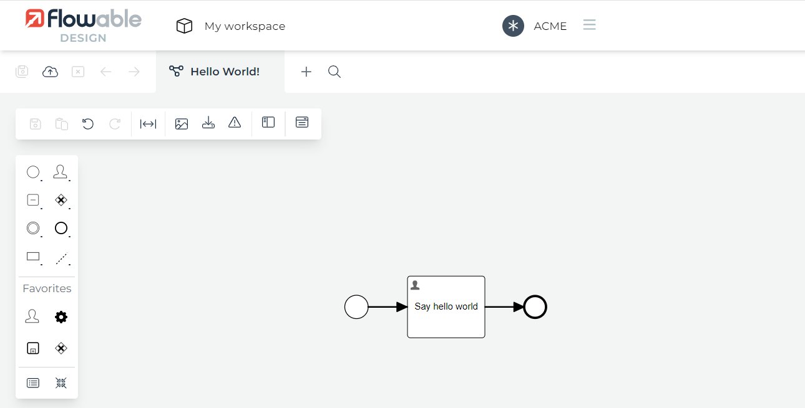

[version: 0.0.2](https://github.com/crystal-processes/crp-flowable-springboot-sample/releases/tag/crp-flowable-springboot-sample-0.0.2)

[tag: crp-flowable-springboot-sample-0.0.2](https://github.com/crystal-processes/crp-flowable-springboot-sample/releases/tag/crp-flowable-springboot-sample-0.0.2)

## :sunny: What was done
The [acme application model](../../src/main/resources/apps/acme-bar.zip) was created in flowable cloud designer.

Exported [acme-bar.zip](https://github.com/crystal-processes/crp-flowable-springboot-sample/commit/72b6657490c2740d86d083314ab11941cacf2ba7#diff-f560d6ffb8aab7489c1d92d4076d095a9a5052538e803572e31e6e7d3f18fc53) file was added to `src/main/resources/apps/` directory for automated deployment.
The happy path jUnit test was added in the following [commit](https://github.com/crystal-processes/crp-flowable-springboot-sample/commit/72b6657490c2740d86d083314ab11941cacf2ba7#diff-5c80c6fe57043ccfeb87e4a7eefa23903f8d7a7ab61cf8e6298ab3bc28dbdb2d).

## :partly_sunny: What to do next - Tests
Models are not tested. The statement is true for almost all the projects. My current project observation is that 
the test coverage of model vary between 6% - 20%. The tests are even more important, if you take into consideration 
versioning. The support of different versions of the model, which must be supported in runtime.

There is not one root cause. The reasons depend on the project. 
- Modelers are not developers. The ordinary modeler does not know how to write automated tests. There were several
proposals for improvements. I have seen only one project, which uses automated tests from modelers. Flowable 6.x has 
[a generator for BPM tests](https://gromar01.wordpress.com/2017/10/05/process-tests-without-side-effects/). Flowable 7.0.0
does not.
- Developers/Modelers are not forced to write model tests. The answer for the question "What is the test coverage of 
models in your project?" is "I do not know". I have not seen any monitoring tool for the model test coverage yet.
  [The prototype](https://gromar01.wordpress.com/2022/06/08/sonarqube-process-test-coverage/)
- If you write the model test, the code is not readable. It is unclear, what is real flowable API call and what is assertion. 
If you read [the whole test class](https://github.com/crystal-processes/crp-flowable-springboot-sample/commit/72b6657490c2740d86d083314ab11941cacf2ba7#diff-5c80c6fe57043ccfeb87e4a7eefa23903f8d7a7ab61cf8e6298ab3bc28dbdb2d), it is even worse.

## Flowable fluent assertions
[The benefit is obvious](https://github.com/crystal-processes/crp-flowable-springboot-sample/commit/89fbdf46cea2e2235e8e34dc86ffe960d2584667):

### Before

https://github.com/crystal-processes/crp-flowable-springboot-sample/blob/f33a00ac53aa97136cd978326b938748cf1d3ec1/src/test/java/org/crp/flowable/springboot/sample/model/HelloWorldProcessTest.java#L61-L102

### After with fluent assertions

https://github.com/crystal-processes/crp-flowable-springboot-sample/blob/f33a00ac53aa97136cd978326b938748cf1d3ec1/src/test/java/org/crp/flowable/springboot/sample/model/HelloWorldProcessTest.java#L24-L59

### Groovy tests
The groovy tests can be even more readable:

https://github.com/crystal-processes/crp-flowable-springboot-sample/blob/a104ec735f37200a5eef93aab16142488c3cf82b/src/test/groovy/org/crp/flowable/springboot/sample/HelloWorldProcessGroovyTest.groovy#L19-L54