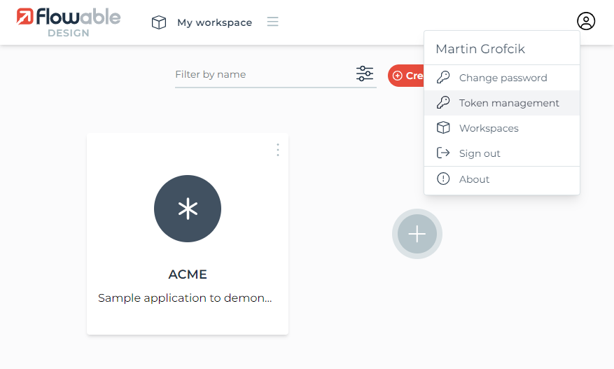
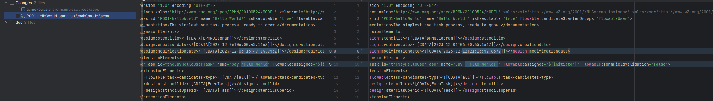

## Why to integrate model into build and repository.
- Manual model downloading is error-prone.
- The automation can support model unzipping/zipping to track changes in gitlab.
- Branching & merging.

## How
- Create [flowable open-source account](https://www.flowable.com/account/open-source).
- Login to [cloud designer](https://cloud.flowable.com/design/)
- Create or import application. Use e.g. [acme application model](../../src/main/resources/apps) from the project for import.
- Generate token


- Set `FLOWABLE_TOKEN` environment variable in operating system. (There are other possibilities for [crp-flowable-shell](https://github.com/crystal-processes/crp-flowable-ex/tree/main/crp-flowable-shell) too.)
- Set application name in the `pom.xml`
  https://github.com/crystal-processes/crp-flowable-springboot-sample/blob/c66819a1c703d9c59c27aa12ee95d47c9c636b6a/pom.xml#L20-L24
`downloadModel` maven profile and [crp-flowable-shell](https://github.com/crystal-processes/crp-flowable-ex/tree/main/crp-flowable-shell) do the rest.
```shell
$ ./mvnw generate-resources -PdownloadModel
```
| maven phase        | [crp-flowable-shell](https://github.com/crystal-processes/crp-flowable-ex/tree/main/crp-flowable-shell) command | Description                                                                                     |
|--------------------|-----------------------------------------------------------------------------------------------------------------|-------------------------------------------------------------------------------------------------|
| generate-sources   | designer-export ${application.name} --output-file-name target/temp_${application.name}.zip                      | Export model from designer and download model to temporary file. `downloadModel` profile.       |
| process-sources    | unzip target/temp_${application.name}.zip src/main/model/${application.name}                                    | Unzip temporary model to model directory to allow local changes. `downloadModel` profile.       |                                                      
| generate-resources | zip src/main/model/${application.name} src/main/resources/apps/${application.name}-bar.zip                      | Zip model files into deployable bar file again. Part of default build to include local changes. |
- Check changes in your favorite IDE


`crp-flowable-shell` provides useful commands also for `6.x` flowable modeler 
```shell
$ java -jar ~/.m2/repository/io/github/crystal-processes/crp-flowable-shell/0.0.5/crp-flowable-shell-0.0.5.jar
crp-flowable-shell:>help
help
AVAILABLE COMMANDS

Deployment
       list-deployments, lsd: list deployments
       rmd, delete-deployments: Delete all deployments with given name, tenantId from runtime. WARNING - use only for testing purposes
       deploy: Deploy given application

Designer
       dx, designer-export: Export application model from modeler to file.

Model
       import: Import file to modeler.
       ls, list: List models.
       rm, delete-model: Delete model from modeler.
       export-bar: Export deployable model from modeler to file.
       export: Export model from modeler to file.

Raw Rest
       ex, execute: execute url.
       exl, execute-logged: execute url with logged in client.

Template Processor
       gt, generate-test: Generate test from flowable history.

Utils
       zip: Zip directory to file.
       configure: Configure flowable rest endpoint.
       unzip: Unzip file to directory.
crp-flowable-shell:>
```