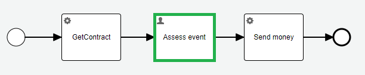

### Use case:

Version 0.2.0 insurance event processing:


The process model changes a little in version 0.2.1. The contract entity, returned from the `getContract` service task,
changes in the version 0.2.1:
```java
    private final Account account; //Complex structure instead of plain String
```
The call to external service `Send money` changes accordingly:


The test `InsuranceEventTest` passes without any issue:

https://github.com/crystal-processes/crp-flowable-springboot-sample/blob/7b9daf483b87beff3c949d9f2aa2df8e526e239e/src/test/java/org/crp/flowable/springboot/sample/insurance/InsuranceEventTest.java#L30-L47

### :warning: Problem:
Running `v0.2.0` `P002-processInsuranceEvent` process instances, waiting on the decision on the `Assess event` user task,



are not able to deserialize `Contract` entity in the next step `Send money` service task.
[The upgrade test project](https://github.com/crystal-processes/crp-sample-upgrade-test) is able to detect the issue
in the following [test](https://github.com/crystal-processes/crp-sample-upgrade-test/blob/main/release-0.2.1/src/test/java/org/crp/flowable/springboot/sample/upgrade/ContinueInV2InsuranceEventProcessTest.java#L30).

```java
    @Test
    void continueInV1InsuranceEventProcessInstance() {
        ProcessInstance processInsuranceEvent = runtimeService.createProcessInstanceQuery()
                .processInstanceName("Insurance event process instance from release 0.2.0")
                .singleResult();
        Task assessEventTask = taskService.createTaskQuery().processInstanceId(processInsuranceEvent.getId()).singleResult();

        assertThatThrownBy(
                () -> taskService.complete(assessEventTask.getId(), Map.of("amount", 5))
        ).isInstanceOf(FlowableException.class)
                .hasMessage("Couldn't deserialize object in variable 'contract'");
    }
```

### Solution proposal
[Process instance migration](https://www.flowable.com/open-source/docs/bpmn/ch08-ProcessInstanceMigration) can help a little.
There are plenty of limitations. (What to do if process is completed already?) I would like to dedicate one step to `migration`.
