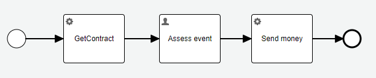

### Use case:

Let's take the [same use case](01_serializable.md). The `contract.account` has changed from simple `String` value to complex `Account`
structure.



The difference is only in the `contract` variable instantiated in `GetContract` service task.
Initial contract structure in `v0.2.2`:
```json
{
  "account" : "account-id",
  "maxAmount": 10000
}
```
`Send money` service task [P002-processInsuranceEvent v0.2.2](https://github.com/crystal-processes/crp-flowable-springboot-sample/blob/23b3ae07264a981fcb19b95303232c753906cd06/src/main/model/acme/P002-processInsuranceEvent.bpmn#L16):

https://github.com/crystal-processes/crp-flowable-springboot-sample/blob/23b3ae07264a981fcb19b95303232c753906cd06/src/main/model/acme/P002-processInsuranceEvent.bpmn#L16-L16

Is changed to `v0.2.3`:
```json
{
  "account" : { "owner" : "jlong", "id":"account-id" },
  "maxAmount": 10000
}
```
`Send money` service task uses following expression [P002-processInsuranceEvent v0.2.3](https://github.com/crystal-processes/crp-flowable-springboot-sample/blob/945b354684623ff23e39d1803ab96dcff0a226f8/src/main/model/acme/P002-processInsuranceEvent.bpmn#L16)::

https://github.com/crystal-processes/crp-flowable-springboot-sample/blob/945b354684623ff23e39d1803ab96dcff0a226f8/src/main/model/acme/P002-processInsuranceEvent.bpmn#L16-L16

The tests works fine in:
[versioning upgrade project](https://github.com/crystal-processes/crp-sample-upgrade-test)
```shell
 echo '--------------------------------------------------------------'
 echo '--- Testing upgrade from release-0.2.2 -> release-0.2.3    ---'
 echo '--- json serialization                                     ---'
# generate v 0.2.2 data
  ./mvnw --projects release-0.2.2 clean test -Dspring.profiles.active=generateData
 # test process execution on the version 0.2.0
  ./mvnw --projects release-0.2.3 clean test
```

and for the latest application version too:
https://github.com/crystal-processes/crp-flowable-springboot-sample/blob/2fe6220b5d53497d5fb7ab43414da780bb532e98/src/test/java/org/crp/flowable/springboot/sample/insurance/InsuranceEventTest.java#L30-L48

### :warning: Problem
If the operation on structure is outside the process model, we are in the similar trouble as in 
[java serialization](01_serializable.md#warning-problem).

**Example:**
Create a report with

| account | Amount sent |
|---------|-------------|

where account is `account id`.
