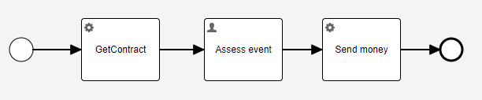

### Use case:

Let's take the [same use case](01_serializable.md) with JPA serialization. The task is to change contract structure in the next step. 
The [reporting complexity](02_json.md) was already shown. We can use a luxury of sample application and start from the 
scratch with jpa.



The initial contract is:
```java
@Entity
@Table(
        name = "APP_CONTRACT"
)
@Builder @AllArgsConstructor @NoArgsConstructor
@Getter @Setter
public class ContractEntity {

    @Id
    @GeneratedValue(strategy = GenerationType.SEQUENCE, generator = "APP_CONTRACT_SEQ")
    @SequenceGenerator(name="APP_CONTRACT_SEQ", allocationSize = 1)
    private Integer id;

    private String contractId;

    private String account;

    private int maxAmount;
}
```
Liquibase is used for the database schema management. The only necessary think is to allow liquibase in properties and create changelog file. 
```properties
spring.liquibase.enabled=true
spring.liquibase.change-log=config/liquibase/app-change-log.xml
```

And now let's do the same change request as before. The `contract.account` has changed from simple `String` value to 
complex `Account` structure.
