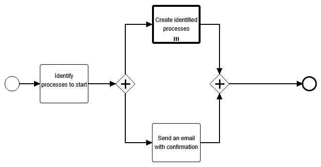

## Processing Received Emails in the 'Acme' Insurance Company

### Receive an Email

There are several ways to read an email and forward it to Flowable. In this example, we use [spring-integration-mail](https://docs.spring.io/spring-integration/reference/mail.html).

The mail listener and message handler are initialized here:  
https://github.com/crystal-processes/crp-flowable-springboot-sample/blob/58f894e01bf73aab6847230d70de3ff61aecbdd5/src/main/java/org/crp/flowable/springboot/sample/AcmeAiConfiguration.java#L19-L33

The `startProcessMessageHandler` is responsible for sending a message to the appropriate process:  
https://github.com/crystal-processes/crp-flowable-springboot-sample/blob/58f894e01bf73aab6847230d70de3ff61aecbdd5/src/main/java/org/crp/flowable/springboot/sample/services/impl/StartProcessMessageHandler.java#L35-L46

---

### Process Model

Once the process instance is started with the email content, the `Identify processes to start` task is reached. At this point, the AI is invoked.

The service task is defined here:  
https://github.com/crystal-processes/crp-flowable-springboot-sample/blob/58f894e01bf73aab6847230d70de3ff61aecbdd5/src/main/model/acme/P005-aiMessageInputHandler.bpmn#L9-L10

The `ChatClientJavaDelegate` is responsible for sending the email content to the chat client. Integration is handled using [spring-ai](https://spring.io/projects/spring-ai).

The chat client task configuration consists of two parts:

1. **`system`** – Describes [the general purpose of the task](https://github.com/crystal-processes/crp-flowable-springboot-sample/blob/58f894e01bf73aab6847230d70de3ff61aecbdd5/src/main/model/acme/P005-aiMessageInputHandler.bpmn#L16-L45) in a human-readable way.
2. **`user`** – Represents the received email data, e.g.:  
   https://github.com/crystal-processes/crp-flowable-springboot-sample/blob/58f894e01bf73aab6847230d70de3ff61aecbdd5/src/main/model/acme/P005-aiMessageInputHandler.bpmn#L49
---

### Input & Output

The input to the `Identify processes to start` task is the email content in a structured format:  
https://github.com/crystal-processes/crp-flowable-springboot-sample/blob/bf8736bc51c6a474674253b96b383935fbb00ced/src/test/groovy/org/crp/flowable/springboot/sample/ai/AiMessageInputHandlerTest.groovy#L83-L91

The task's output:  
https://github.com/crystal-processes/crp-flowable-springboot-sample/blob/bf8736bc51c6a474674253b96b383935fbb00ced/src/test/resources/chatClient-happy-response.json#L1-L13

The result is stored in the `processedInput` variable and includes:
- A list of processes to start
- The email content to use in a reply

For more details, see the [AiMessageInputHandlerTest](https://github.com/crystal-processes/crp-flowable-springboot-sample/blob/bf8736bc51c6a474674253b96b383935fbb00ced/src/test/groovy/org/crp/flowable/springboot/sample/ai/AiMessageInputHandlerTest.groovy#L81)
